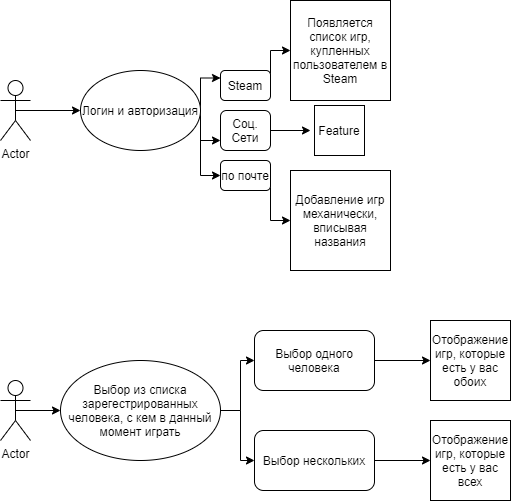

# Graduation-Harman
Данное приложение ориентировано на группу игроков, 
которые при сборе больше чем 2 человека, не могут решить, 
во что сыграть.
* https://support.russianit.ru/hc/ru/articles/360007793600-%D0%A3%D1%81%D1%82%D0%B0%D0%BD%D0%BE%D0%B2%D0%BA%D0%B0-%D0%A1%D0%A3%D0%91%D0%94-PostgreSQL-%D0%BD%D0%B0-%D0%9E%D0%A1-Windows DB

При 2-ух игроках, проблема не ощутима, при 3-ех - принятие решения может занять
какое-то время. При 5-ых игроках, выбор может тянуться весь вечер.

* https://ru.stackoverflow.com/questions/443423/Переход-на-другую-активити-при-совпадении-нескольких-условий переходы на активити

 
 * https://api-docs.igdb.com/#examples
